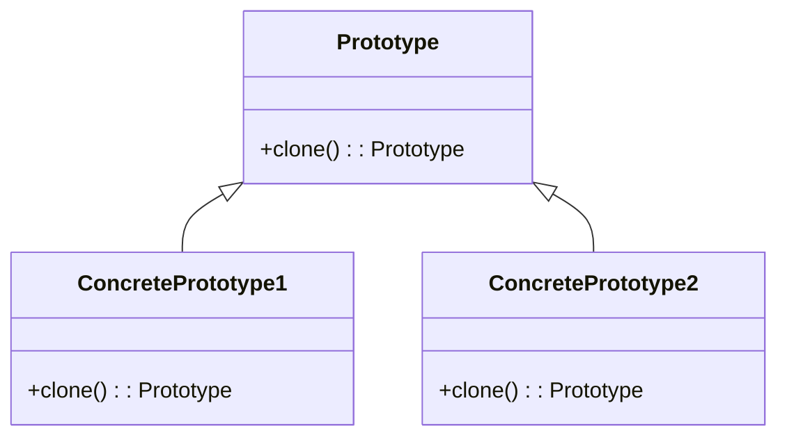
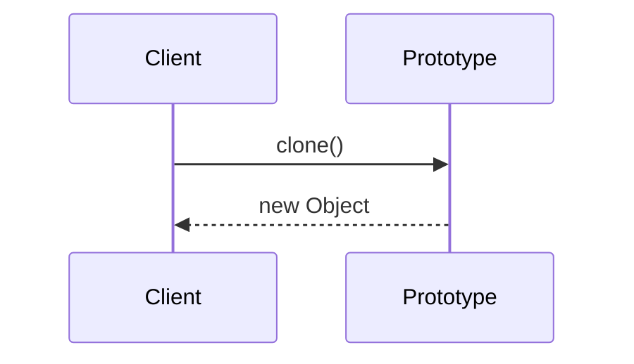
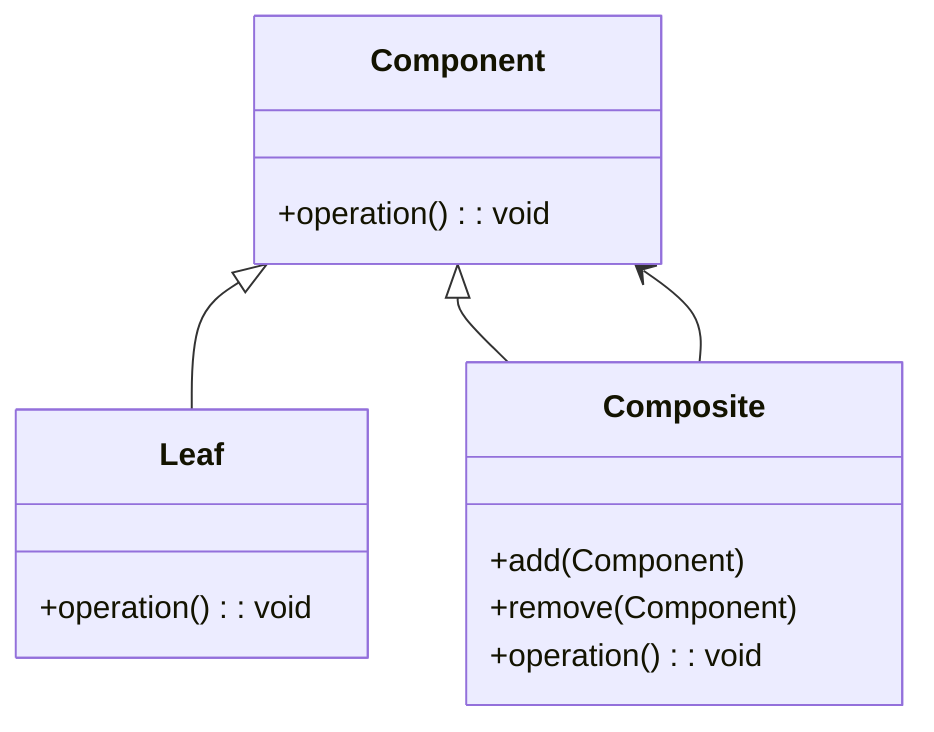
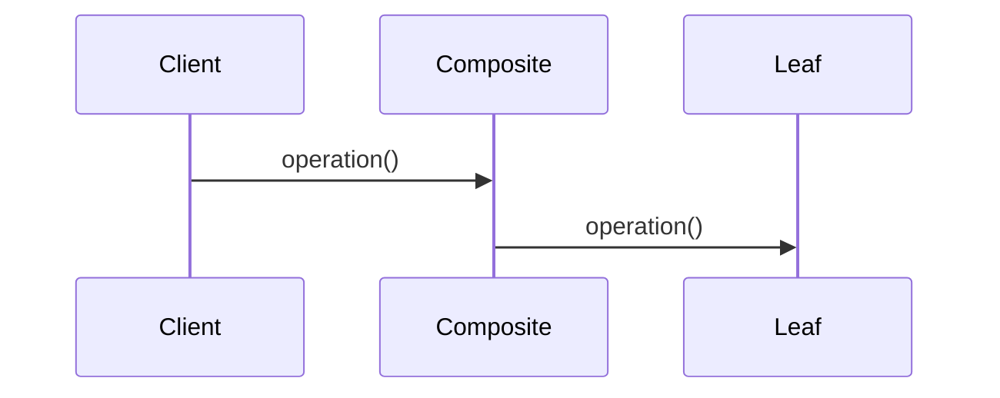
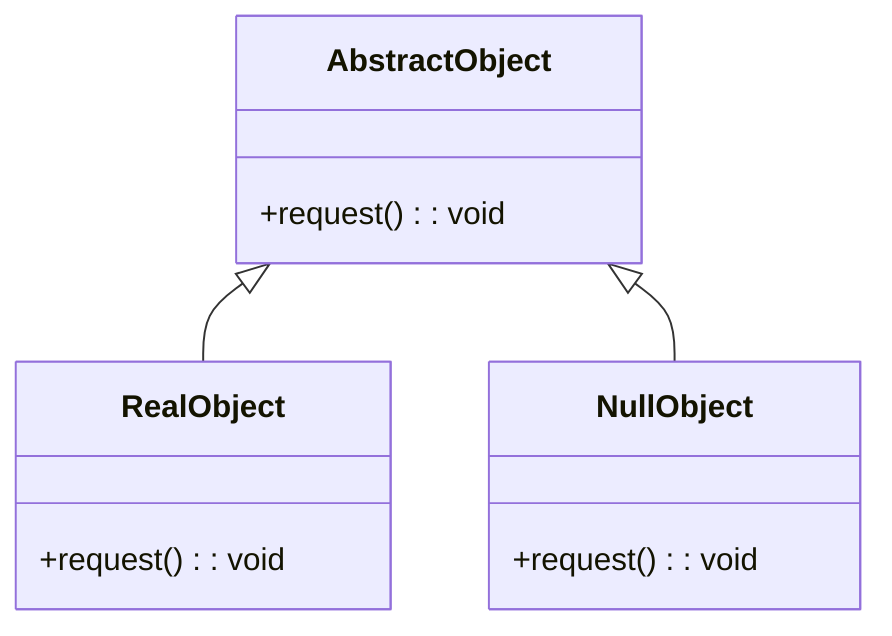
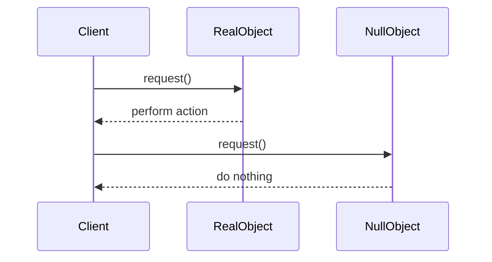
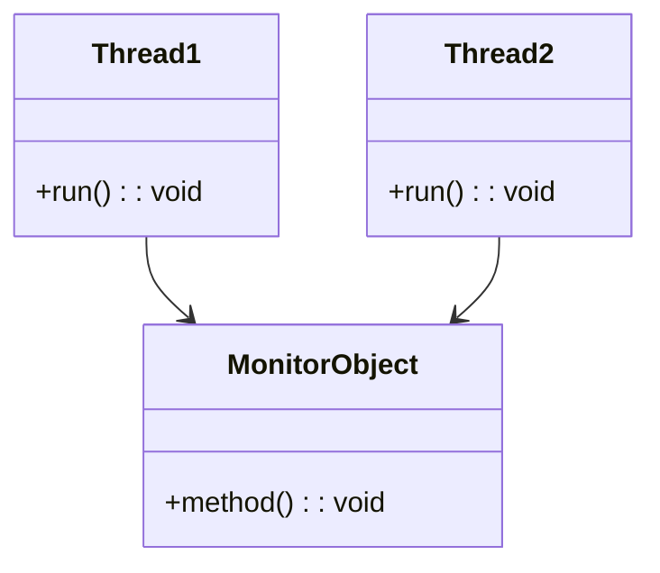
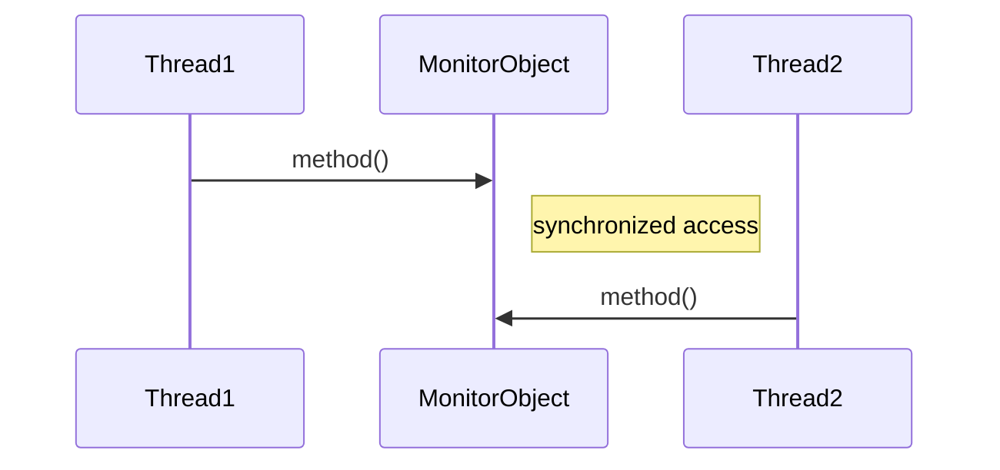

# Design Patterns

Цей документ містить опис шаблонів проектування та їх графічне подання у вигляді UML-діаграм, створених за допомогою інструменту візуалізації Mermaid.

## Prototype (Creational Pattern)

### Опис
Шаблон Prototype використовується для створення нових об'єктів шляхом клонування існуючих. Це корисно, коли створення нових об'єктів є дорогим або складним процесом.

### UML-діаграма класів

### UML-діаграма взаємодії

## Composite (Structural Pattern)

### Опис
Шаблон Composite дозволяє об'єднувати об'єкти в дерево структури для представлення ієрархії частина-ціле. Це дозволяє клієнтам поводитися з окремими об'єктами та їхніми композиціями однаково.

### UML-діаграма класів

### UML-діаграма взаємодії

## Null Object (Behavioral Pattern)

### Опис
Шаблон Null Object представляє об'єкт з нейтральною поведінкою, що мінімізує необхідність перевірок на null.

### UML-діаграма класів

### UML-діаграма взаємодії

## Monitor Object (Concurrency Pattern)

### Опис
Шаблон Monitor Object дозволяє управляти доступом до об'єкта серед багатьох потоків, забезпечуючи синхронізацію.

### UML-діаграма класів

### UML-діаграма взаємодії

